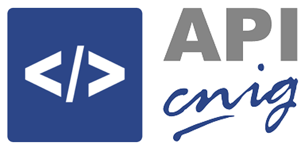

<p align="center">
  
</p>
<h1 align="center"><strong>APICNIG</strong> <small>🔌 M.plugin.QueryAttributes</small></h1>

<p align="center">
  <a title="MIT License" href="LICENSE.md">
    
  </a>
  <a title="Node version" href="#">
    
  </a>  
  <a title="NPM version" href="#">
    
  </a>  
  <br />
  <br />
</p>

## Descripción 👷

Plugin que permite aplicar filtros sobre las capas de un mapa y visualizar de forma gráfica las features que cumplen los filtros. Permite guardar consultas, combinarlas y exportar los resultados de estas.

## Dependencias 👷

- queryattributes.ol.min.js
- queryattributes.ol.min.css


```html
 <link href="../../plugins/queryattributes/queryattributes.ol.min.css" rel="stylesheet" />
 <script type="text/javascript" src="../../plugins/queryattributes/queryattributes.ol.min.js"></script>
```

## Parámetros 👷

- El constructor se inicializa con un JSON de _options_ con los siguientes atributos:

- **collapsed**. Indica si el plugin viene cerrado por defecto (true/false).
- **collapsible**. Indica si el plugin se puede cerrar (true/false).
- **position**. Indica la posición donde se mostrará el plugin
  - 'TL':top left (default)
  - 'TR':top right
  - 'BL':bottom left
  - 'BR':bottom right
- **filters**: Cuando toma el valor false, en cada panning muestra en la tabla los registros que se encuentran en el bounding box de la pantalla. Cuando toma valor tres, muestra botones para establecer filtro por bounding box o por poligono trazado por el usuario.

## Ejemplos de uso 👷

### Ejemplo 1
```javascript
   const map = M.map({
     container: 'map'
   });

   const mp = new M.plugin.QueryAttributes({
     collapsed: true,
     collapsible: true,
     position: 'TL',
   });

   map.addPlugin(mp);
```

## 📸 Capturas 👷

Lorem ipsum asdkjasjdlajldjal

## 👨‍💻 Desarrollo

Para el stack de desarrollo de este componente se ha utilizado

* NodeJS Version: 14.16
* NPM Version: 6.14.11

## 📐 Para configurar el stack de desarrollo

### 1️⃣ Instalación de dependencias / *Install Dependencies*

```bash
npm i
```

### 2️⃣ Arranque del servidor de desarrollo / *Run Application*

```bash
npm run start
```

## 📂 Estructura del código / *Code scaffolding*

```any
/
├── assets 🌈               # Recursos
├── src 📦                  # Código fuente.
├── task 📁                 # EndPoints
├── test 📁                 # Testing
├── tmp 📁                  # Destination directory for images.
└── ...
```
## 📌 Metodoloías y pautas de desarrollo / *Methodologies and Guidelines*

Metodologías y herramientas usadas en el proyecto para garantizar el Quality Assurance Code (QAC)

* ESTlint
  * [NPM ESLint](https://www.npmjs.com/package/eslint) \
  * [NPM ESLint | Airbnb](https://www.npmjs.com/package/eslint-config-airbnb)

## ⛽️ Revisión e instalación de dependencias / *Review and Update Dependencies*

Para la revisión y actualización de las dependencias de los paquetes npm es necesario instalar de manera global el paquete/ módulo "npm-check-updates".

```bash
# Install and Run
$npm i -g npm-check-updates
$ncu
```

## 🚔 Licencia

* [European Union Public Licence v1.2](https://raw.githubusercontent.com/JoseJPR/tutorial-nodejs-cli-system-notification/main/README.md)

## ⛲️ Recursos y Herranientas

* [APICNIG](https://componentes.ign.es/api-core/doc/)
* [Mapea Plugins](https://github.com/sigcorporativo-ja/mapea-plugins)
* [APICNIG Plugins](https://componentes.ign.es/api-core/test.html)
* [Wiki APICNIG](https://github.com/IGN-CNIG/API-CNIG/wiki)
